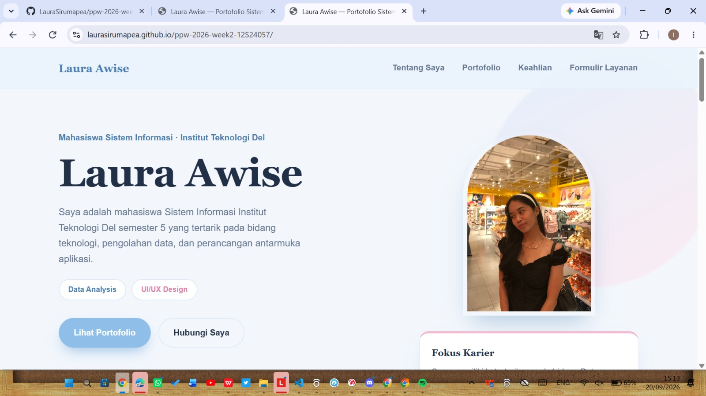

# PPW 2026 Week 2 - HTML5, CSS3 & Web Interface

## Identitas Mahasiswa

- **Nama:** Laura Sirumapea
- **NIM:** 12S24057
- **Program Studi:** Sistem Informasi
- **Mata Kuliah:** Pemrograman dan Pengujian Aplikasi Web
- **Institut:** Institut Teknologi Del

## Deskripsi

Repository ini berisi tugas praktikum Pemrograman dan Pengujian Aplikasi Web Minggu 02.

Pada praktikum ini dibuat sebuah halaman web portofolio profil profesional menggunakan HTML5 dan CSS3 dengan menerapkan struktur HTML semantik, tabel data, HTML Lists, formulir interaktif, desain responsif, serta prinsip aksesibilitas.

## Teknologi yang Digunakan

- HTML5
- CSS3
- Git
- GitHub
- GitHub Pages
- Visual Studio Code

## Fitur

- Struktur HTML5 semantik
- Profil mahasiswa
- Informasi akademik
- Tabel riwayat proyek/mata kuliah
- HTML Lists
- Formulir layanan/kontak
- Validasi input HTML5
- Responsive Web Design
- CSS Flexbox/Grid
- Hover interaction
- Modern UI dengan rounded corners dan box-shadow

## Struktur Project

```text
praktikum01/
├── index.html
├── style.css
├── README.md
└── assets/
    └── laura.jpeg
     └── screenshot.png

    ## GitHub Pages

Website ini telah dipublikasikan menggunakan GitHub Pages.

**Live Demo:**  
https://laurasirumapea.github.io/ppw-2026-week2-12S24057/

## Screenshot

Berikut merupakan tampilan halaman web portofolio yang telah dibuat:

