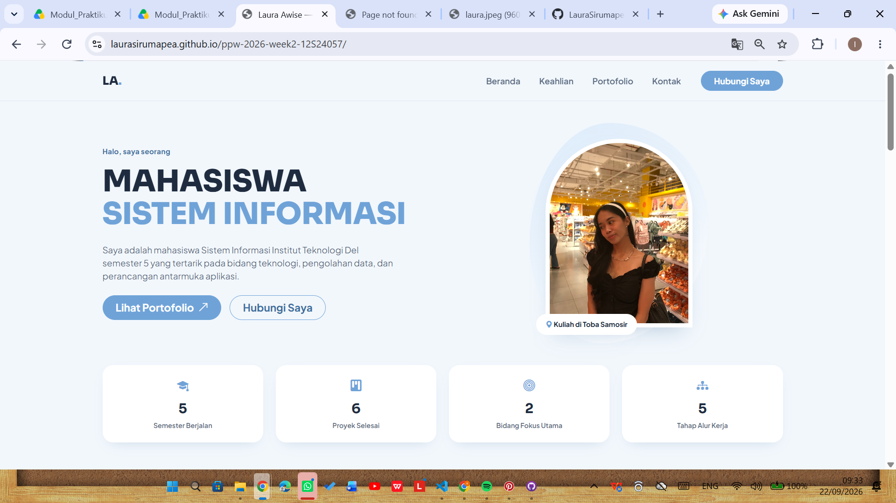

# Portofolio Sistem Informasi — Laura Awise

## Identitas Pengembang
- **Nama** : Laura Awise
- **NIM** : 12S24057
- **Kelas** : 13SI
- **Mata Kuliah** : Pemrograman dan Pengujian Web (12S3101)

## Ringkasan Pembaruan (Minggu 3)
Proyek portofolio pribadi ini di-*refactor* dari HTML/CSS murni (Minggu 2) menjadi
berbasis **Bootstrap 5.3** yang dipadukan dengan custom CSS override
(`custom-style.css`). Pembaruan utama meliputi:
- Navbar responsif dengan tombol hamburger (`navbar-toggler`)
- Hero section dengan CTA dan foto profil
- Statistik ringkas dan kartu keahlian
- Grid portofolio berbasis `.card` + **Bootstrap Modal** untuk detail tiap proyek
- Formulir layanan dengan **Floating Labels**, **Input Group** berikon, dan validasi visual Bootstrap
- Tema warna personal (biru pastel) melalui CSS Custom Properties di `:root`

## Live Demo
(https://laurasirumapea.github.io/ppw-2026-week2-12S24057/)

## Perbandingan Sebelum vs Sesudah Integrasi Framework

| Aspek | Sebelum (Minggu 2 — CSS Murni) | Sesudah (Minggu 3 — Bootstrap 5) |
|---|---|---|
| Layout | Flexbox/Grid manual per section | Sistem grid 12 kolom Bootstrap (`row`, `col-*`) |
| Navigasi | Daftar tautan `<nav>` statis | Navbar `sticky-top` dengan hamburger collapse di mobile |
| Data Proyek | Tabel semantik (`<table>`) | Grid kartu (`.card`) + Modal detail per proyek |
| Formulir | Input polos + label manual | Floating Labels, Input Group berikon, validasi visual Bootstrap |
| Styling | 100% custom CSS dari nol | Bootstrap sebagai fondasi + `custom-style.css` untuk theming personal |
| Variabel Warna | Hardcoded di tiap rule | Terpusat lewat CSS Custom Properties (`:root`) |
| Ikon | Tidak ada | Bootstrap Icons |

_(Tambahkan screenshot tampilan sebelum & sesudah di sini, misalnya:)_

```


```

## Cara Menjalankan Secara Lokal
1. Clone repositori ini.
2. Buka `index.html` langsung di browser, atau gunakan ekstensi **Live Server** di VS Code.
3. Pastikan koneksi internet aktif (Bootstrap & font dimuat via CDN).

## Struktur Folder
```
├── index.html
├── custom-style.css
├── README.md
└── assets/
    └── laura.jpeg
    └── screenshot-sebelum.png
```